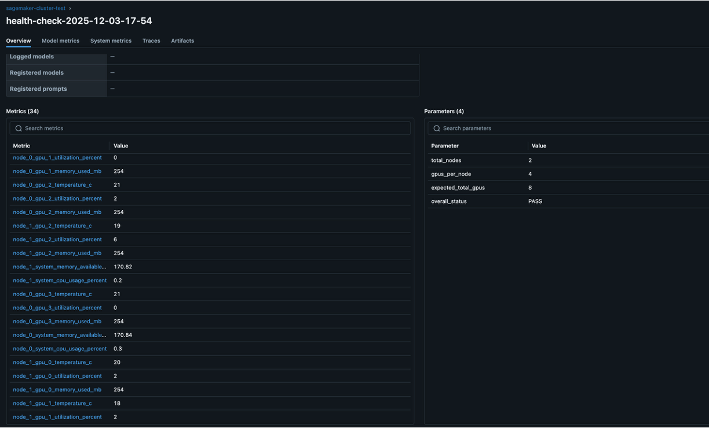

# SageMaker Training Jobs Cluster Health Checks

**Comprehensive pre-flight validation for SageMaker multi-GPU training clusters to prevent costly training failures.**

## What This Does

This tool runs **before** your actual training job to validate that your SageMaker cluster is properly configured and ready for distributed GPU training. It performs comprehensive health checks across:

- **GPU Hardware**: Memory, temperature, drivers, utilization
- **Network Fabric**: EFA (Elastic Fabric Adapter) connectivity for multi-node communication
- **Inter-GPU Communication**: NCCL performance testing across nodes and GPUs
- **System Resources**: CPU, memory, disk availability
- **Hardware Diagnostics**: DCGM validation for GPU health

## Why This Is Important

**Training jobs on large GPU clusters are expensive and time-sensitive.** Common issues that cause training failures:

- **Network misconfiguration**: EFA not properly configured, causing communication timeouts
- **GPU hardware issues**: Memory errors, thermal throttling, driver problems
- **NCCL communication failures**: Poor bandwidth between nodes, blocking collective operations
- **Resource constraints**: Insufficient memory, disk space, or CPU resources

**Cost Impact**: A failed 8-GPU training job can waste hundreds of dollars and hours of compute time. This tool catches issues in minutes, not hours.

## Where To Use

### **Pre-Training Validation**

- Run before expensive multi-GPU training jobs
- Validate new cluster configurations
- Test after infrastructure changes

### **Cluster Commissioning**

- Validate new SageMaker training environments
- Verify EFA network setup for multi-node training
- Baseline performance testing for GPU clusters

### **Troubleshooting**

- Diagnose training job failures
- Identify performance bottlenecks
- Validate fixes after infrastructure changes

### **CI/CD Pipelines**

- Automated cluster validation before training workflows
- Infrastructure testing in MLOps pipelines
- Performance regression detection

## Use Cases by Scale

| Scenario        | Instance Count       | Primary Validation                            |
| --------------- | -------------------- | --------------------------------------------- |
| **Single GPU**  | 1 × ml.g5.xlarge     | GPU health, basic diagnostics                 |
| **Multi-GPU**   | 1 × ml.g5.12xlarge   | GPU communication, NCCL performance           |
| **Multi-Node**  | 2+ × ml.p4d.24xlarge | Inter-node networking, EFA validation         |
| **Large Scale** | 4+ × ml.p5.48xlarge  | Full cluster communication, bandwidth testing |

## Health Checks Performed

### **GPU Health Validation**

- **Hardware Detection**: GPU count, model identification (A10G, V100, etc.)
- **Memory Analysis**: Total, used, free memory per GPU
- **Thermal Monitoring**: Temperature readings and thermal throttling detection
- **Power Management**: Power draw monitoring and efficiency validation
- **Driver Validation**: NVIDIA driver version compatibility
- **Utilization Tracking**: GPU usage percentage and availability

### **System Resource Validation**

- **Memory Analysis**: RAM availability, usage patterns, memory pressure
- **Disk Space**: Storage capacity, free space, I/O performance readiness
- **CPU Monitoring**: Core utilization, availability for training processes
- **Resource Sufficiency**: Validates adequate resources for distributed training

### **Network Fabric Testing**

- **EFA Detection**: Elastic Fabric Adapter availability and configuration
- **Provider Validation**: Network provider enumeration and health
- **Connectivity Testing**: Inter-node communication pathway validation
- **Bandwidth Readiness**: Network fabric performance for multi-node training

### **NCCL Communication Performance**

- **All-Reduce Testing**: Collective operation bandwidth across GPUs/nodes
- **All-Gather Validation**: Data gathering performance and reliability
- **Dynamic Scaling**: Test parameters adapt to cluster size (1-8+ GPUs)
- **Performance Metrics**: Bandwidth measurements (GB/s) with thresholds
- **Timeout Management**: Appropriate limits for single vs multi-node setups

### **DCGM Hardware Diagnostics**

- **Basic Validation**: Driver, NVML, CUDA library compatibility
- **Extended Testing**: PCIe connectivity, GPU memory integrity
- **Stress Testing**: Targeted power and memory bandwidth validation
- **Deployment Checks**: Permissions, environment variables, persistence mode
- **Hardware Health**: Comprehensive GPU subsystem validation

### **Cluster-Level Analysis**

- **Topology Detection**: World size, node count, GPUs per node mapping
- **Multi-node Identification**: Distributed environment configuration
- **Communication Patterns**: Inter-node vs intra-node performance testing
- **Performance Baselines**: Bandwidth thresholds and optimization recommendations

### **Intelligent Reporting**

- **Overall Status**: PASS/WARN/FAIL with clear reasoning
- **Issue Identification**: Specific problems with root cause analysis
- **Actionable Recommendations**: Performance tuning and configuration guidance
- **Cost-Benefit Analysis**: Training readiness vs investigation requirements

## Quick Start

1. **Login to ECR (if using AWS SageMaker base image)**

```bash
aws ecr get-login-password --region <REGION> | docker login --username AWS --password-stdin <IMAGE_URI>
```

2. **Build and push container**

```bash
cd container
./create-image.sh sagemaker-cluster-test latest
```

3. **Run health checks**

- Open `notebook.ipynb`
- Update networking configuration (subnet/security group IDs)
- Execute cells to launch training job

## What It Checks

- **GPU**: Memory, temperature, utilization, driver version
- **System**: CPU, memory, disk usage
- **Network**: EFA availability and fabric info
- **Communication**: NCCL all_reduce/all_gather tests
- **Hardware**: DCGM diagnostics

## Configuration

Update in notebook:

```python
# Instance configuration
instance_type = "ml.g5.12xlarge"
instance_count = 2

# Networking (required)
networking = Networking(
    subnet_ids=["subnet-xxxxxxxxx"],
    security_group_ids=["sg-xxxxxxxxx"],
)
```

## Distributed Configuration Scenarios

| Scenario                    | Instance Count | Torchrun Required | Configuration                                                                                                     |
| --------------------------- | -------------- | ----------------- | ----------------------------------------------------------------------------------------------------------------- |
| **Single node, single GPU** | 1              | No                | Remove `distributed=Torchrun()`                                                                                   |
| **Single node, multi-GPU**  | 1              | Optional          | Use `distributed=Torchrun()` or `distributed=MPI(process_count_per_node=<NUM_GPUS>)` for GPU communication tests  |
| **Multi-node, single GPU**  | >1             | Yes               | Use `distributed=Torchrun()` or `distributed=MPI(process_count_per_node=<NUM_GPUS>)` for inter-node communication |
| **Multi-node, multi-GPU**   | >1             | Yes               | Use `distributed=Torchrun()` or `distributed=MPI(process_count_per_node=<NUM_GPUS>)` for full cluster validation  |

**When to use Torchrun:**

- **Required**: Multi-node setups (validates inter-node communication)
- **Recommended**: Multi-GPU scenarios (tests NCCL across GPUs)
- **Optional**: Single GPU (basic health checks only)

**Example configurations:**

```python
# Single node health check
model_trainer = ModelTrainer(
    # ... other config
    # distributed=Torchrun(),  # Remove this line
)

# Multi-node cluster validation
model_trainer = ModelTrainer(
    # ... other config
    distributed=Torchrun(),  # Keep this line
)
```

## Output

Health check metrics saved to:

- S3: `s3://bucket/job-name/metrics/health_check_metrics.json`
- CloudWatch Logs: Training job logs

## Dockerfile Customization

The Dockerfile has two sections:

**Customizable** (can be changed):

- `FROM` base image
- Any additional packages before the required section

**Required** (DO NOT REMOVE):

```dockerfile
### Required Packages for the cluster test. DO NOT REMOVE ###
RUN apt-get update && apt-get install -y \
    libfabric-dev \
    datacenter-gpu-manager \
    && rm -rf /var/lib/apt/lists/*

# Install NCCL tests
RUN git clone https://github.com/NVIDIA/nccl-tests.git /opt/nccl-tests && \
    cd /opt/nccl-tests && \
    make && \
    ln -s /opt/nccl-tests /usr/local/cuda/efa/test-

RUN pip install "psutil>=5.9.0"
```

These packages enable:

- `libfabric-dev`: EFA network fabric support
- `datacenter-gpu-manager`: GPU diagnostics via DCGM
- `nccl-tests`: Multi-GPU communication validation
- `psutil`: System resource monitoring

## Requirements

- AWS CLI configured
- Docker installed
- SageMaker execution role with ECR permissions
- VPC with EFA-enabled subnets for multi-node jobs

## Output

Example json output:

```json
{
  "timestamp": "2025-12-03T17:54:41.475022+00:00",
  "cluster_info": {
    "data_completeness": "complete",
    "note": "Data from all 2 nodes",
    "expected_total_gpus": 8,
    "cluster_topology": {
      "total_nodes": 2,
      "gpus_per_node": 4,
      "processes_per_node": 4
    }
  },
  "cluster_summary": {
    "overall_status": "PASS",
    "test_results": {
      "gpu_detection": true,
      "efa_network": true,
      "nccl_communication": true,
      "dcgm_basic": true,
      "dcgm_extended": true
    },
    "cluster_info": {},
    "performance_summary": {
      "distributed_all_reduce_bandwidth_gbps": 1.81
    },
    "issues": [],
    "recommendations": [
      "Cluster is ready for distributed training"
    ]
  },
  "nodes": {
    "node_0": {
      "timestamp": "2025-12-03T17:54:41.475022+00:00",
      "node_info": {
        "world_size": 8,
        "rank": 0,
        "local_rank": 0,
        "hostname": "ip-10-2-252-142.ec2.internal",
        "current_host": "algo-1",
        "host_rank": 0,
        "host_count": 2,
        "gpus_per_host": 4
      },
      "summary": {
        "overall_status": "PASS",
        "test_results": {
          "gpu_detection": true,
          "efa_network": true,
          "nccl_communication": true,
          "dcgm_basic": true,
          "dcgm_extended": true
        },
        "cluster_info": {},
        "performance_summary": {
          "distributed_all_reduce_bandwidth_gbps": 1.81
        },
        "issues": [],
        "recommendations": [
          "Cluster is ready for distributed training"
        ]
      },
      "gpu": {
        "gpu_0": {
          "name": "NVIDIA A10G",
          "driver_version": "570.195.03",
          "memory_total_mb": 23028,
          "memory_used_mb": 254,
          "memory_free_mb": 22583,
          "temperature_c": 22,
          "utilization_percent": 2,
          "power_draw_w": 22.75
        },
        "gpu_1": {
          "name": "NVIDIA A10G",
          "driver_version": "570.195.03",
          "memory_total_mb": 23028,
          "memory_used_mb": 254,
          "memory_free_mb": 22583,
          "temperature_c": 22,
          "utilization_percent": 0,
          "power_draw_w": 21.16
        },
        ...
      },
      "system": {
        "memory": {
          "total_gb": 186.7,
          "available_gb": 170.84,
          "used_percent": 8.5
        },
        "disk": {
          "total_gb": 119.94,
          "free_gb": 78.73,
          "used_percent": 34.36
        },
        "cpu": {
          "usage_percent": 0.3,
          "count": 48
        }
      },
      "network": {
        "aws_ofi_nccl_plugin": {
          "installed": true,
          "path": "/opt/amazon/ofi-nccl/lib/x86_64-linux-gnu/libnccl-net.so"
        },
        "efa_available": true,
        "efa_providers": [
          "provider: efa",
          "provider: efa",
          "provider: efa"
        ],
        "efa_provider_count": 3,
        "efa_communication_test": {
          "success": true,
          "raw_output": "bytes   #sent   #ack     total       time     MB/sec    usec/xfer   Mxfers/sec\n64      10      =10      1.2k        0.00s      1.13      56.65       0.02\n256     10      =10      5k          0.00s      4.58      55.90       0.02\n1k      10      =10      20k         0.00s     18.35      55.80       0.02\n4k      10      =10      80k         0.00s     68.15      60.10       0.02\n",
          "test_role": "server",
          "rank": 0
        }
      },
      "nccl": {
        "nccl_tests_available": true,
        "communication_tests": {
          "distributed_all_reduce": {
            "success": true,
            "test_type": "distributed",
            "processes_tested": 8,
            "results": [
              {
                "size_bytes": 1024,
                "bandwidth_gbps": 0.0,
                "latency_ms": 0.47
              },
              {
                "size_bytes": 1048576,
                "bandwidth_gbps": 0.58,
                "latency_ms": 1.8
              },
              {
                "size_bytes": 134217728,
                "bandwidth_gbps": 1.81,
                "latency_ms": 74.35
              }
            ],
            "peak_bandwidth_gbps": 1.81
          }
        }
      },
      "dcgm": {
        "dcgm_available": true,
        "diagnostics": {
          "basic": {
            "success": true,
            "parsed_output": {
              "dcgm_version": "3.3.9",
              "driver_version": "570.195.03",
              "gpu_device_ids": "2237,2237,2237,2237",
              "test_results": {
                "deployment": {
                  "Denylist": "Pass",
                  "NVML Library": "Pass",
                  "CUDA Main Library": "Pass",
                  "Permissions and OS Blocks": "Pass",
                  "Persistence Mode": "Pass",
                  "Environment Variables": "Pass",
                  "Page Retirement/Row Remap": "Pass",
                  "Graphics Processes": "Pass",
                  "Inforom": "Pass"
                }
              },
              "overall_status": "Pass"
            },
            "raw_output": "Successfully ran diagnostic for group.\n+---------------------------+------------------------------------------------+\n| Diagnostic                | Result                                         |\n+===========================+================================================+\n|-----  Metadata  ----------+------------------------------------------------|\n| DCGM Version              | 3.3.9                                          |\n| Driver Version Detected   | 570.195.03                                     |\n| GPU Device IDs Detected   | 2237,2237,2237,2237                            |\n|-----  Deployment  --------+------------------------------------------------|\n| Denylist                  | Pass                                           |\n| NVML Library              | Pass                                           |\n| CUDA Main Library         | Pass                                           |\n| Permissions and OS Blocks | Pass                                           |\n| Persistence Mode          | Pass                                           |\n| Environment Variables     | Pass                                           |\n| Page Retirement/Row Remap | Pass                                           |\n| Graphics Processes        | Pass                                           |\n| Inforom                   | Pass                                           |\n+---------------------------+------------------------------------------------+\n"
          },
          "extended": {
            "success": true,
            "parsed_output": {
              "dcgm_version": "3.3.9",
              "driver_version": "570.195.03",
              "gpu_device_ids": "2237,2237,2237,2237",
              "test_results": {
                "deployment": {
                  "Denylist": "Pass",
                  "NVML Library": "Pass",
                  "CUDA Main Library": "Pass",
                  "Permissions and OS Blocks": "Pass",
                  "Persistence Mode": "Pass",
                  "Environment Variables": "Pass",
                  "Page Retirement/Row Remap": "Pass",
                  "Graphics Processes": "Pass",
                  "Inforom": "Pass"
                },
                "integration": {
                  "PCIe": "Pass - All"
                },
                "hardware": {
                  "GPU Memory": "Pass - All",
                  "Diagnostic": "Pass - All"
                },
                "stress": {
                  "Targeted Stress": "Pass - All",
                  "Targeted Power": "Pass - GPUs: 0, 2, 3",
                  "Warning": "GPU 1 Max power of 224.1 did not reach desire",
                  "Info": "GPU 3 GPU 3 max power: 225.6 W average power",
                  "Memory Bandwidth": "Pass - All",
                  "EUD Test": "Skip - All"
                }
              },
              "overall_status": "Mixed"
            },
            "raw_output": "Successfully ran diagnostic for group.\n+---------------------------+------------------------------------------------+\n| Diagnostic                | Result                                         |\n+===========================+================================================+\n|-----  Metadata  ----------+------------------------------------------------|\n| DCGM Version              | 3.3.9                                          |\n| Driver Version Detected   | 570.195.03                                     |\n| GPU Device IDs Detected   | 2237,2237,2237,2237                            |\n|-----  Deployment  --------+------------------------------------------------|\n| Denylist                  | Pass                                           |\n| NVML Library              | Pass                                           |\n| CUDA Main Library         | Pass                                           |\n| Permissions and OS Blocks | Pass                                           |\n| Persistence Mode          | Pass                                           |\n| Environment Variables     | Pass                                           |\n| Page Retirement/Row Remap | Pass                                           |\n| Graphics Processes        | Pass                                           |\n| Inforom                   | Pass                                           |\n+-----  Integration  -------+------------------------------------------------+\n| PCIe                      | Pass - All                                     |\n+-----  Hardware  ----------+------------------------------------------------+\n| GPU Memory                | Pass - All                                     |\n| Diagnostic                | Pass - All                                     |\n+-----  Stress  ------------+------------------------------------------------+\n| Targeted Stress           | Pass - All                                     |\n| Targeted Power            | Pass - GPUs: 0, 2, 3                           |\n|                           | Fail - GPU: 1                                  |\n| Warning                   | GPU 1 Max power of 224.1 did not reach desire  |\n|                           | d power minimum target_power_min_ratio of 224  |\n|                           | .2 for GPU 1 Verify that the clock speeds and  |\n|                           |  GPU utilization are high.                     |\n| Info                      | GPU 0 GPU 0 max power: 299.5 W average power   |\n|                           | usage: 299.0 W                                 |\n| Info                      | GPU 2 GPU 2 max power: 227.0 W average power   |\n|                           | usage: 224.0 W                                 |\n| Info                      | GPU 3 GPU 3 max power: 225.6 W average power   |\n|                           | usage: 223.9 W                                 |\n| Memory Bandwidth          | Pass - All                                     |\n| EUD Test                  | Skip - All                                     |\n+---------------------------+------------------------------------------------+\n",
            "stdout": "Successfully ran diagnostic for group.\n+---------------------------+------------------------------------------------+\n| Diagnostic                | Result                                         |\n+===========================+================================================+\n|-----  Metadata  ----------+------------------------------------------------|\n| DCGM Version              | 3.3.9                                          |\n| Driver Version Detected   | 570.195.03                                     |\n| GPU Device IDs Detected   | 2237,2237,2237,2237                            |\n|-----  Deployment  --------+------------------------------------------------|\n| Denylist                  | Pass                                           |\n| NVML Library              | Pass                                           |\n| CUDA Main Library         | Pass                                           |\n| Permissions and OS Blocks | Pass                                           |\n| Persistence Mode          | Pass                                           |\n| Environment Variables     | Pass                                           |\n| Page Retirement/Row Remap | Pass                                           |\n| Graphics Processes        | Pass                                           |\n| Inforom                   | Pass                                           |\n+-----  Integration  -------+------------------------------------------------+\n| PCIe                      | Pass - All                                     |\n+-----  Hardware  ----------+------------------------------------------------+\n| GPU Memory                | Pass - All                                     |\n| Diagnostic                | Pass - All                                     |\n+-----  Stress  ------------+------------------------------------------------+\n| Targeted Stress           | Pass - All                                     |\n| Targeted Power            | Pass - GPUs: 0, 2, 3                           |\n|                           | Fail - GPU: 1                                  |\n| Warning                   | GPU 1 Max power of 224.1 did not reach desire  |\n|                           | d power minimum target_power_min_ratio of 224  |\n|                           | .2 for GPU 1 Verify that the clock speeds and  |\n|                           |  GPU utilization are high.                     |\n| Info                      | GPU 0 GPU 0 max power: 299.5 W average power   |\n|                           | usage: 299.0 W                                 |\n| Info                      | GPU 2 GPU 2 max power: 227.0 W average power   |\n|                           | usage: 224.0 W                                 |\n| Info                      | GPU 3 GPU 3 max power: 225.6 W average power   |\n|                           | usage: 223.9 W                                 |\n| Memory Bandwidth          | Pass - All                                     |\n| EUD Test                  | Skip - All                                     |\n+---------------------------+------------------------------------------------+\n",
            "stderr": "",
            "exit_code_zero": false
          }
        }
      }
    },
    "node_1": {
      "timestamp": "2025-12-03T17:54:41.475121+00:00",
      "node_info": {
        "world_size": 8,
        "rank": 4,
        "local_rank": 0,
        "hostname": "ip-10-2-199-122.ec2.internal",
        "current_host": "algo-2",
        "host_rank": 1,
        "host_count": 2,
        "gpus_per_host": 4
      },
      "summary": {
        "overall_status": "PASS",
        "test_results": {
          "gpu_detection": true,
          "efa_network": true,
          "nccl_communication": true,
          "dcgm_basic": true,
          "dcgm_extended": true
        },
        "cluster_info": {},
        "performance_summary": {
          "distributed_all_reduce_bandwidth_gbps": 1.81
        },
        "issues": [],
        "recommendations": [
          "Cluster is ready for distributed training"
        ]
      },
      "gpu": {
        "gpu_0": {
          "name": "NVIDIA A10G",
          "driver_version": "570.195.03",
          "memory_total_mb": 23028,
          "memory_used_mb": 254,
          "memory_free_mb": 22583,
          "temperature_c": 20,
          "utilization_percent": 2,
          "power_draw_w": 21.9
        },
        "gpu_1": {
          "name": "NVIDIA A10G",
          "driver_version": "570.195.03",
          "memory_total_mb": 23028,
          "memory_used_mb": 254,
          "memory_free_mb": 22583,
          "temperature_c": 18,
          "utilization_percent": 2,
          "power_draw_w": 22.4
        },
        ...
      },
      "system": {
        "memory": {
          "total_gb": 186.7,
          "available_gb": 170.82,
          "used_percent": 8.5
        },
        "disk": {
          "total_gb": 119.94,
          "free_gb": 78.73,
          "used_percent": 34.36
        },
        "cpu": {
          "usage_percent": 0.2,
          "count": 48
        }
      },
      "network": {
        "aws_ofi_nccl_plugin": {
          "installed": true,
          "path": "/opt/amazon/ofi-nccl/lib/x86_64-linux-gnu/libnccl-net.so"
        },
        "efa_available": true,
        "efa_providers": [
          "provider: efa",
          "provider: efa",
          "provider: efa"
        ],
        "efa_provider_count": 3,
        "efa_communication_test": {
          "success": true,
          "raw_output": "bytes   #sent   #ack     total       time     MB/sec    usec/xfer   Mxfers/sec\n64      10      =10      1.2k        0.00s      1.17      54.55       0.02\n256     10      =10      5k          0.00s      4.76      53.75       0.02\n1k      10      =10      20k         0.00s     19.00      53.90       0.02\n4k      10      =10      80k         0.00s     70.38      58.20       0.02\n",
          "test_role": "client",
          "rank": 4
        }
      },
      "nccl": {
        "nccl_tests_available": true,
        "communication_tests": {
          "distributed_all_reduce": {
            "success": true,
            "test_type": "distributed",
            "processes_tested": 8,
            "results": [
              {
                "size_bytes": 1024,
                "bandwidth_gbps": 0.0,
                "latency_ms": 0.45
              },
              {
                "size_bytes": 1048576,
                "bandwidth_gbps": 0.57,
                "latency_ms": 1.83
              },
              {
                "size_bytes": 134217728,
                "bandwidth_gbps": 1.81,
                "latency_ms": 74.36
              }
            ],
            "peak_bandwidth_gbps": 1.81
          }
        }
      },
      "dcgm": {
        "dcgm_available": true,
        "diagnostics": {
          "basic": {
            "success": true,
            "parsed_output": {
              "dcgm_version": "3.3.9",
              "driver_version": "570.195.03",
              "gpu_device_ids": "2237,2237,2237,2237",
              "test_results": {
                "deployment": {
                  "Denylist": "Pass",
                  "NVML Library": "Pass",
                  "CUDA Main Library": "Pass",
                  "Permissions and OS Blocks": "Pass",
                  "Persistence Mode": "Pass",
                  "Environment Variables": "Pass",
                  "Page Retirement/Row Remap": "Pass",
                  "Graphics Processes": "Pass",
                  "Inforom": "Pass"
                }
              },
              "overall_status": "Pass"
            },
            "raw_output": "Successfully ran diagnostic for group.\n+---------------------------+------------------------------------------------+\n| Diagnostic                | Result                                         |\n+===========================+================================================+\n|-----  Metadata  ----------+------------------------------------------------|\n| DCGM Version              | 3.3.9                                          |\n| Driver Version Detected   | 570.195.03                                     |\n| GPU Device IDs Detected   | 2237,2237,2237,2237                            |\n|-----  Deployment  --------+------------------------------------------------|\n| Denylist                  | Pass                                           |\n| NVML Library              | Pass                                           |\n| CUDA Main Library         | Pass                                           |\n| Permissions and OS Blocks | Pass                                           |\n| Persistence Mode          | Pass                                           |\n| Environment Variables     | Pass                                           |\n| Page Retirement/Row Remap | Pass                                           |\n| Graphics Processes        | Pass                                           |\n| Inforom                   | Pass                                           |\n+---------------------------+------------------------------------------------+\n"
          },
          "extended": {
            "success": true,
            "parsed_output": {
              "dcgm_version": "3.3.9",
              "driver_version": "570.195.03",
              "gpu_device_ids": "2237,2237,2237,2237",
              "test_results": {
                "deployment": {
                  "Denylist": "Pass",
                  "NVML Library": "Pass",
                  "CUDA Main Library": "Pass",
                  "Permissions and OS Blocks": "Pass",
                  "Persistence Mode": "Pass",
                  "Environment Variables": "Pass",
                  "Page Retirement/Row Remap": "Pass",
                  "Graphics Processes": "Pass",
                  "Inforom": "Pass"
                },
                "integration": {
                  "PCIe": "Pass - All"
                },
                "hardware": {
                  "GPU Memory": "Pass - All",
                  "Diagnostic": "Pass - All"
                },
                "stress": {
                  "Targeted Stress": "Pass - All",
                  "Targeted Power": "Pass - All",
                  "Memory Bandwidth": "Pass - All",
                  "EUD Test": "Skip - All"
                }
              },
              "overall_status": "Mixed"
            },
            "raw_output": "Successfully ran diagnostic for group.\n+---------------------------+------------------------------------------------+\n| Diagnostic                | Result                                         |\n+===========================+================================================+\n|-----  Metadata  ----------+------------------------------------------------|\n| DCGM Version              | 3.3.9                                          |\n| Driver Version Detected   | 570.195.03                                     |\n| GPU Device IDs Detected   | 2237,2237,2237,2237                            |\n|-----  Deployment  --------+------------------------------------------------|\n| Denylist                  | Pass                                           |\n| NVML Library              | Pass                                           |\n| CUDA Main Library         | Pass                                           |\n| Permissions and OS Blocks | Pass                                           |\n| Persistence Mode          | Pass                                           |\n| Environment Variables     | Pass                                           |\n| Page Retirement/Row Remap | Pass                                           |\n| Graphics Processes        | Pass                                           |\n| Inforom                   | Pass                                           |\n+-----  Integration  -------+------------------------------------------------+\n| PCIe                      | Pass - All                                     |\n+-----  Hardware  ----------+------------------------------------------------+\n| GPU Memory                | Pass - All                                     |\n| Diagnostic                | Pass - All                                     |\n+-----  Stress  ------------+------------------------------------------------+\n| Targeted Stress           | Pass - All                                     |\n| Targeted Power            | Pass - All                                     |\n| Memory Bandwidth          | Pass - All                                     |\n| EUD Test                  | Skip - All                                     |\n+---------------------------+------------------------------------------------+\n",
            "stdout": "Successfully ran diagnostic for group.\n+---------------------------+------------------------------------------------+\n| Diagnostic                | Result                                         |\n+===========================+================================================+\n|-----  Metadata  ----------+------------------------------------------------|\n| DCGM Version              | 3.3.9                                          |\n| Driver Version Detected   | 570.195.03                                     |\n| GPU Device IDs Detected   | 2237,2237,2237,2237                            |\n|-----  Deployment  --------+------------------------------------------------|\n| Denylist                  | Pass                                           |\n| NVML Library              | Pass                                           |\n| CUDA Main Library         | Pass                                           |\n| Permissions and OS Blocks | Pass                                           |\n| Persistence Mode          | Pass                                           |\n| Environment Variables     | Pass                                           |\n| Page Retirement/Row Remap | Pass                                           |\n| Graphics Processes        | Pass                                           |\n| Inforom                   | Pass                                           |\n+-----  Integration  -------+------------------------------------------------+\n| PCIe                      | Pass - All                                     |\n+-----  Hardware  ----------+------------------------------------------------+\n| GPU Memory                | Pass - All                                     |\n| Diagnostic                | Pass - All                                     |\n+-----  Stress  ------------+------------------------------------------------+\n| Targeted Stress           | Pass - All                                     |\n| Targeted Power            | Pass - All                                     |\n| Memory Bandwidth          | Pass - All                                     |\n| EUD Test                  | Skip - All                                     |\n+---------------------------+------------------------------------------------+\n",
            "stderr": "",
            "exit_code_zero": true
          }
        }
      }
    }
  }
}
```

Example MLflow output:


